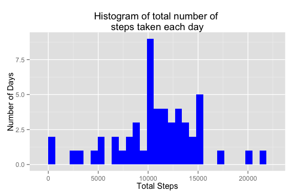
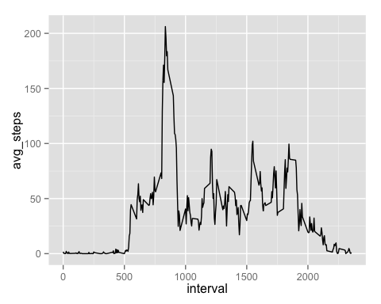
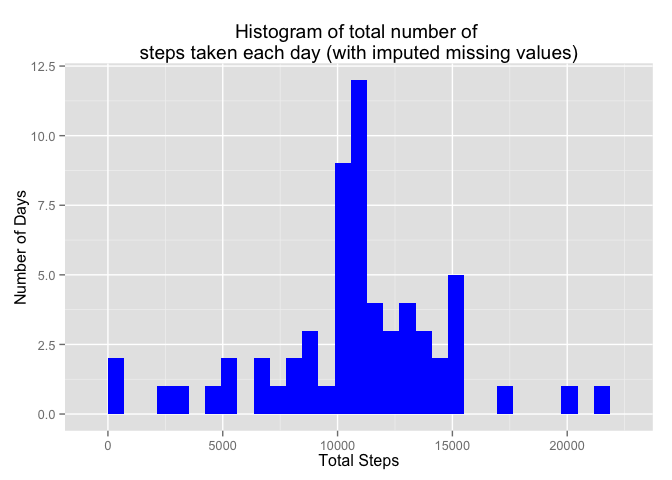
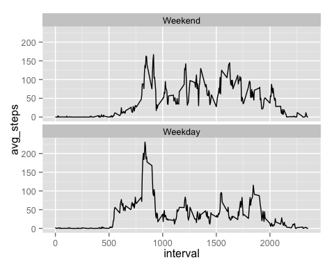

# Reproducible Research: Peer Assessment 1

This document has been produced as per the instructions of a specific coursera course. The purpose is to demonstrate the ability to produce the literate statistical programming.  

The code chunks in this document have been constructed as per the objectives setout in the instructions of the peer assignment.


```r
options(warn = -1)
```

## Loading and preprocessing the data

The dataset activity.csv has been provided by the instructor. This dataset is a csv with three columns; date, interval and steps.  
*Please ensure that you have this dataset in the working directory*  


```r
activity <- read.csv("activity.csv")
```

## What is mean total number of steps taken per day?

```r
library(dplyr)
library(ggplot2)
total_steps <- activity %>%
                group_by(date) %>%
                summarise(total_steps_day = sum(steps, na.rm = TRUE)
                        )
total_steps <- total_steps[total_steps$total_steps_day>0,]
qplot(total_steps$total_steps_day, 
      geom="histogram",
      xlab = "Total Steps",
      ylab = "Number of Days",
      main = "Histogram of total number of \nsteps taken each day",
      fill = I("blue")
      )
```

 

Following code block calculates the avg number of steps taken per day.  


```r
avg_steps <- total_steps %>%
                summarise(avg_steps = mean(total_steps_day))

avg_steps <- as.character(round(avg_steps,0))
```

  
Average number of steps taken per day is 10766  

Following code block shows the median of the steps taken per day  


```r
median_steps <- total_steps %>%
                summarise(med_steps = median(total_steps_day))

median_steps <- as.character(round(median_steps, 0))
```

Median of total number of steps taken per day is 10765  


## What is the average daily activity pattern?

```r
activity_clean <- activity %>% 
                filter(!is.na(steps))

interval_avg_steps <- activity_clean %>%
                        group_by(interval) %>%
                        summarise(avg_steps = mean(steps))

qplot(x = interval,
        y = avg_steps,
        data = interval_avg_steps,
        geom="line")
```

 

```r
interval_max_steps <- activity_clean %>%
                        group_by(interval) %>%
                        summarise(total_steps = mean(steps)) %>%
                        filter(total_steps == max(total_steps))
```

The interval with the max number of average steps is 835.  


## Imputing missing values

```r
# Separate the na from not na values into two datasets
naactivity <- activity[is.na(activity$steps),]
notnaactivity <- activity[!is.na(activity$steps),]

# Determine the total number of rows with missing values
missingValues <- nrow(naactivity)
```

Total number of missing values in the dataset is 2304.  

Next, lets use the average number of steps for those intervals for which we have missing values in a given
day to fill those intervals.


```r
# Calculate the average of non na interval steps per interval
avgIntervalSteps <- notnaactivity %>%
                        group_by(interval) %>%
                        summarise(steps = mean(steps))

avgIntervalSteps <- as.data.frame(avgIntervalSteps)

# Use the avgIntervalSteps to match on interval with the naactivity dataset and update (fill in) the steps in nactivity dataset
naactivity$steps <- avgIntervalSteps[match(naactivity$interval, avgIntervalSteps$interval),2]

# Now that we have filled in the missing na values with the average for that interval use rbind
# to combine this dataset with the notnaactvity dataset.
filledActivity <- rbind(notnaactivity, naactivity)

# Round off the number of values as avg of some steps could have been in decimals.
filledActivity$steps <- round(filledActivity$steps, 0)
```

Now, we will chart a histogram of the imputed (filled in) dataset and calculate the mean and median.  


```r
filledIn_total_steps <- filledActivity %>%
                        group_by(date) %>%
                        summarise(total_steps_day = sum(steps)
                                )

qplot(filledIn_total_steps$total_steps_day, 
      geom="histogram",
      xlab = "Total Steps",
      ylab = "Number of Days",
      main = "Histogram of total number of \nsteps taken each day (with imputed missing values)",
      fill = I("blue")
      )
```

```
## stat_bin: binwidth defaulted to range/30. Use 'binwidth = x' to adjust this.
```

 

As can be observed from the historgram, there is not really much difference between the original dataset
averages of steps vs when we imputed the missing values with the mean of those intervals.

Following code block calculates the avg number of steps taken per day with imputed dataset.  


```r
filled_avg_steps <- filledIn_total_steps %>%
                summarise(avg_steps = mean(total_steps_day))


filled_avg_steps <- as.character(round(filled_avg_steps$avg_steps,0))
```

  
Average number of steps taken per day is 10766.  

Following code block shows the median of the steps taken per day on imputed dataset.  


```r
filled_median_steps <- filledIn_total_steps %>%
                summarise(med_steps = median(total_steps_day))

filled_median_steps <- as.character(round(filled_median_steps$med_steps, 0))
```

Median of total number of steps taken per day is 10762  

*Noticing the mean and median values from the imputed data set and comparing with the original dataset it appears that the mean has remained the same as 10766 steps but the median as changed only very slightly.*  

## Are there differences in activity patterns between weekdays and weekends?  


```r
# Create a factor for dayType to distinguish weekdays from weekends

filledActivity = as.data.frame(filledActivity)
filledActivity$dayType <- factor(weekdays(as.Date(filledActivity$date)) %in% c("Saturday", "Sunday"), 
                                       levels = c(TRUE, FALSE),
                                       labels = c("Weekend", "Weekday")
                                       )

filledActivity_Weekly_Avg <- filledActivity %>%
                        group_by(interval, dayType) %>%
                        summarise(avg_steps = mean(steps))


qplot(x = interval, y = avg_steps, data = filledActivity_Weekly_Avg, geom="line", facets = . ~ dayType) + 
        facet_wrap(~dayType, ncol = 1)
```

 

* The document is now complete as per the programming instructions provided in the assignment.*  
